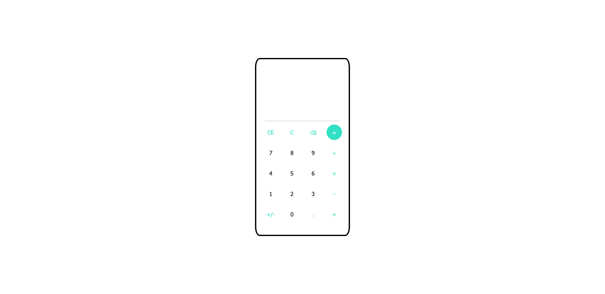

# Calculator

## Table of contents

- [Overview](#overview)
  - [Screenshot](#screenshot)
  - [Links](#links)
- [My process](#my-process)
  - [Built with](#built-with)
- [Author](#author)

## Overview

Minimalistic calculator built in JavaScript.

### Screenshot

### Links
- [Live preview](https://asuujx.github.io/calculator/)
- [Solution repo](https://github.com/asuujx/calculator)

## My process

### Built with

- HTML5 
- CSS
- JavaScript

## Author

- Website - [balon.ovh](https://www.balon.ovh)

